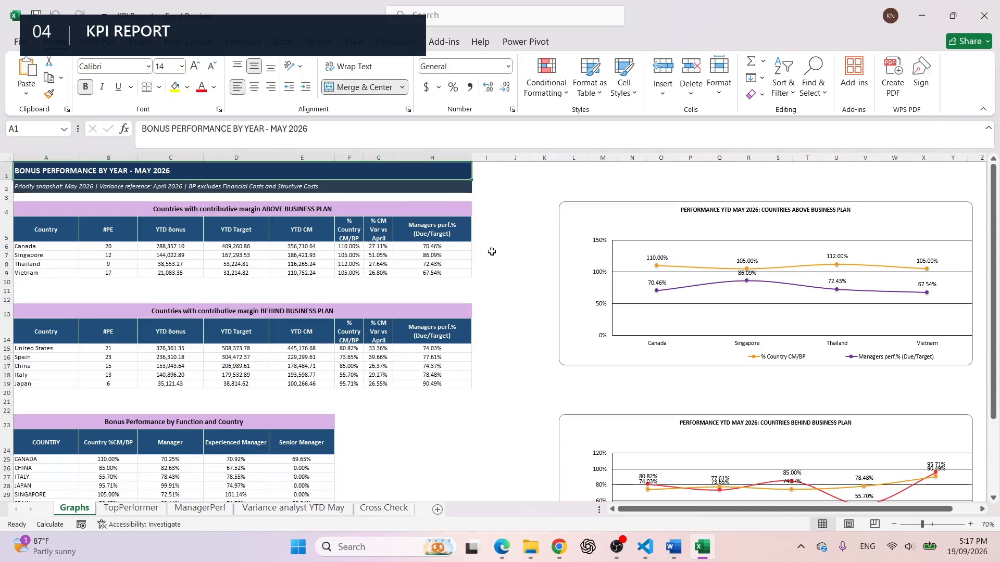

# Monthly Reporting Automation Pipeline

A portfolio-ready Python workflow that turns fragmented monthly Excel inputs into cleaned datasets, a KPI report, a P&L audit workbook and a Word performance analysis.

> **Public-safe case study:** the names, amounts and business scenarios in the downloadable package are synthetic and intended only to demonstrate the workflow. This repository does not reproduce confidential employer data or production systems.

[View the live case study](https://tuankhoi2411.github.io/automation/monthly-reporting-pipeline/) · [Download the complete sample package](downloads/Monthly%20report.zip)



## Review in 60 seconds

| Question | Answer |
|---|---|
| Business problem | Monthly reporting arrives across many Excel files with inconsistent structures and repeated manual preparation. |
| Inputs | 136 manager P&L workbooks plus bonus, manager-cost and country business-plan files. |
| Automation | Clean and standardize source files, align keys, convert local currencies to EUR, consolidate datasets, run control checks and generate reports. |
| Outputs | KPI Report, P&L Audit and Word Performance Analysis, supported by cleaned workbooks. |
| Human review | The pipeline prepares review-ready evidence; management interpretation and decisions remain with the reviewer. |

## What the workflow does

1. Reads the raw manager P&L workbooks and supporting planning files.
2. Standardizes columns, names, dates and numeric fields.
3. Converts local-currency values to EUR and aligns reporting keys.
4. Consolidates the cleaned sources into a comparable reporting model.
5. Runs reconciliation, completeness and variance checks.
6. Produces an Excel KPI report, an Excel P&L audit and a Word performance analysis.

## Outputs

- [`downloads/KPI-Report-Generated.xlsx`](downloads/KPI-Report-Generated.xlsx) — plan, bonus and variance analysis.
- [`downloads/PnL-Audit.xlsx`](downloads/PnL-Audit.xlsx) — project signals, reconciliation checks and audit views.
- [`downloads/KPI-Performance-Review-May-2026.docx`](downloads/KPI-Performance-Review-May-2026.docx) — management-facing performance analysis with supporting charts.
- [`downloads/Monthly report.zip`](downloads/Monthly%20report.zip) — complete sample input, cleaned-data and output package.

## Run locally

Requirements: Python 3.10 or newer.

```powershell
cd automation/monthly-reporting-pipeline
python -m venv .venv
.\.venv\Scripts\Activate.ps1
python -m pip install -r requirements.txt
```

Run the full pipeline against the sample package after extracting it:

```powershell
python Monthly_report_Final.py `
  --input-root "C:\path\to\Monthly report" `
  --output-dir "C:\path\to\Monthly report\Generated output"
```

Optional switches:

```text
--skip-pnl    Skip P&L audit generation
--skip-kpi    Skip KPI Excel and Word generation
```

The input root must contain a `Raw data` folder with the source workbook structure shown in the downloadable sample package.

## Project structure

```text
monthly-reporting-pipeline/
├── assets/
│   ├── monthly-reporting-kpi-poster.png
│   ├── monthly-reporting-workflow.mp4
│   ├── kpi-graphs.png
│   └── pnl-graphs.png
├── downloads/
│   ├── KPI-Report-Generated.xlsx
│   ├── PnL-Audit.xlsx
│   ├── KPI-Performance-Review-May-2026.docx
│   └── Monthly report.zip
├── Monthly_report_Final.py
├── requirements.txt
├── index.html
├── project.css
└── project.js
```

## Design choices

- **Traceability:** cleaned workbooks and control tabs remain inspectable rather than being hidden behind a dashboard.
- **Repeatability:** paths are configurable from the command line, so the workflow can run without editing the source code.
- **Review-first output:** KPI, audit and narrative deliverables are separated according to their review purpose.
- **Portfolio usability:** the case page includes a short video walkthrough, chapter navigation and direct downloads.

## Limitations

- The workflow is a portfolio demonstration, not a production accounting system.
- File schemas are designed around the included sample package; new source layouts require mapping updates.
- Currency conversion, business rules and reporting periods should be validated before any real-world use.
- The pipeline does not replace management review, accounting sign-off or data-governance controls.
